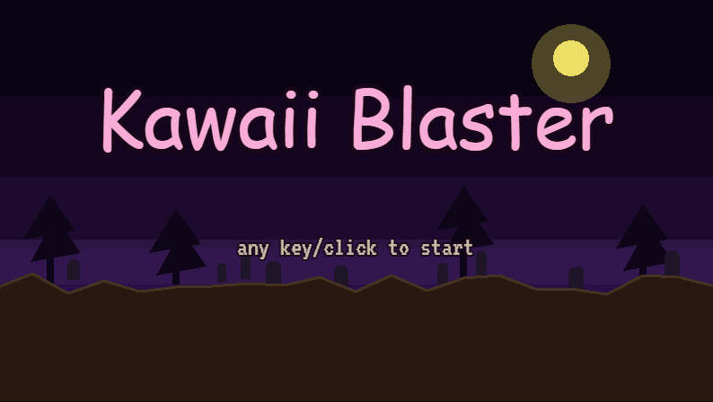

# Kawaii Blaster

Version 0.2.0

A browser-based 2D arcade shooter with a darkly comedic twist: **shoot the cute ones, spare the monsters.**

Parody-first. Pixel art. One level. The joke is on you.



## Why?

This game exists primarily as a **sandbox for agentic coding** — a small, real project used to compare how different AI tools and models handle the same codebase.

Contributors to the experiment:

- **Claude Code** with Sonnet 4.6
- **Grok Build** with Composer 2.5 Fast
- **Gekai Agent** (unreleased, home-grown) with DeepSeek V4 Pro

And yes — it was also made because the world is getting a little too politically correct, so we probably need more **Darth Vader** and more **Thragg**.

## Concept

Kawaii Blaster inverts the moral logic of most shooters. Monsters are safe. Innocents are the target.

You look out over a single landscape — a horizontal ground line that shifts slightly each run. Sprites pop up from behind it, pause briefly, then duck back down. Your mouse cursor is the gun sight; click to shoot.

The challenge is not raw reflexes alone. It is resisting the instinct to blast the skeleton and instead shooting the bunny.

## How to Play

You track **karma**, not score. It starts at 50 and caps at 100.

| Action | Karma |
|--------|-------|
| Shoot a **kawaii** — bunnies, cats, and other adorable creatures | −5 |
| Shoot a **monster** — skeletons, zombies, and other horrors | +10 |
| Let a kawaii escape without shooting | +1 |

Reach **karma 100** and it is game over. Below that, you keep playing. There is one level. The game does not try to be more than it is.

## Requirements

- [Node.js](https://nodejs.org/) v18 or newer
- A modern desktop browser

No `npm install` or build step is required to play; `dist/game.js` is committed.

## Running Locally

From the project root:

```bash
npm start
```

No install, no build — `dist/game.js` is committed and ready to play. Open the URL printed in the terminal (usually `http://localhost:3000`).

## Tech Stack

- **TypeScript** — source language
- **Phaser 3** — game framework
- **esbuild** — zero-config bundler (`dist/game.js`)
